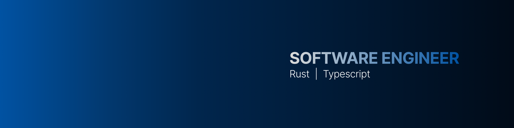

    <h2>👋 Hi, I'm Arthur Hovhannisyan</h2>
    
    <h3>
        Rust & Frontend Lead Engineer | Yerevan, Armenia 
    </h3>

🚀 Strategically transitioning from frontend leadership to Rust systems and backend infrastructure. 
I build high-performance, memory-safe tools and distributed workspaces.

🎓 Graduate of the intensive 6-month Rust course at Yandex Practicum.

---
🛠️ Technical Toolkit
- Languages: Rust, TypeScript, WebAssembly, Bash
- Backend: gRPC (Tonic), REST (Actix, Axum), SQLx, PostgreSQL
- Safety/Perf: Miri (concurrency checking), Criterion (benchmarking), Valgrind
- DevOps: Custom CI/CD (GitHub Actions), Docker, Protobuf/OpenAPI

📂 Featured Projects
- [Distributed Blog Service](https://github.com/arthurhovhannisyan31/blog): A full-stack Rust workspace using Tokio, Tonic (gRPC), and Dioxus (Wasm) for end-to-end type safety.
- [Image Processing Engine](https://github.com/arthurhovhannisyan31/image-editor): A high-performance CLI utilizing FFI/C ABI to manipulate large-scale binary data through Rust's ownership model.
- [Real-time Streaming application](https://github.com/arthurhovhannisyan31/stocks): Engineered a reliable data streaming application over TCP/UDP with active health checks.

🌱 Currently Exploring
- Secure, high-throughput systems-level programming.
- Advanced asynchronous runtimes and low-level network protocols.
- Performant backend services.

📫 Connect with me: [LinkedIn](http://linkedin.com/in/arthurhovhannisyan) | arthurhovhannisyan31@gmail.com

---

